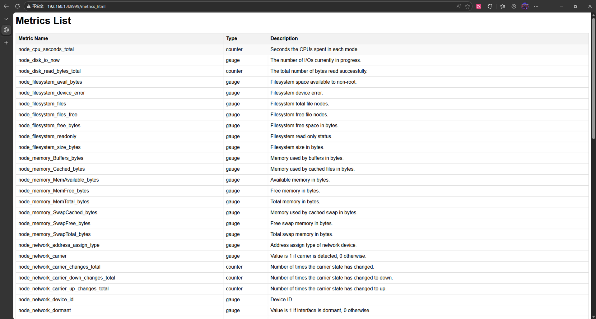

# FastAPI + Prometheus Exporter

This is a Prometheus Exporter based on Python, and metrics are exposed with Fast API.

## Features

- Same metrics as Node Exporter, which allow you to migrate from Node Exporter to this exporter easily.

- Support metrics: 
  - Memory metrics
  - CPU metrics
  - Disk metrics
  - Network metrics
  - Filesystem metrics
- An HTML doc page to display metrics
- Only support Linux for now.

#### 1. Set up environment

Install uv (if you didn't install uv yet)

```bash
pip install uv
```

------------------------------------------------------------------------------------------------
**ex.** How to change source for uv(for China main land)

create uv global config file:

- Windows:
create `/uv/uv.toml` under `%APPDATA%/`
- Linux/MacOS:
create `/uv/uv.toml` under `~/.config/`

add following lines to `uv.toml`:

```
[[index]]
url = "https://mirrors.aliyun.com/pypi/simple/"
default = true
# 或使用清华源
# url = "https://pypi.tuna.tsinghua.edu.cn/simple/"
```
------------------------------------------------------------------------------------------------

Then, run `uv sync` to install dependencies.

#### 2. Run Backend

```bash
uv run main.py
```

For development, you need to set `DEV` environment variable to `true` (see `core/config.py` for details)

- windows powershell:
```bash
$env:DEV = "true"
uv run main.py
```

- linux/macos terminal:
```bash
export DEV="true"
uv run main.py
```

Same, you can set `PORT` environment variable to change the port (default is 9000)

#### 3. Check Metrics

Access `http://127.0.0.1:PORT/metrics` or `http://127.0.0.1:PORT/metrics_html` to check metrics.
